在计算光化学中，优化分子的激发态几何结构是理解光化学反应机理的关键步骤。然而，这个看似简单的任务实际上充满挑战。想象一下这样的场景：你想要优化某个分子的S2，但在优化过程中，随着分子几何构型的变化，原本的S2态可能会变成S1，甚至S3。如果不加以追踪，优化算法很容易丢失目标，最终得到的不是你想要的那个电子态的最小值，而是另一个完全不同性质的态。这就是激发态追踪（state tracking）要解决的核心问题：**如何在几何优化过程中始终跟随具有相同电子性质的态，即所谓的"diabatic态"？**

## 激发态优化的挑战

激发态优化面临两大主要挑战：

首先是**电子重排与几何重组的耦合**。当分子的原子位置发生变化时，电子的分布也会随之改变。对于所有激发态而言，这种电子重排都在同步发生，使得识别"你想要的那个态"变得困难。

其次是**态交叉现象**。在优化过程中，不同性质的激发态的能量顺序可能会发生变化。比如，某一步S₅是你关心的π→π\*跃迁态，但下一步它可能在能量上变成了S₆，而原来的S₆（可能是个n→π*态）变成了新的S₅。如果优化程序只是简单地跟随"第五激发态"这个标签，就会在交叉点处错误地跳到另一个态上。

更多信息：[谈谈势能面交叉对激发态优化的影响](http://bbs.keinsci.com/forum.php?mod=viewthread&tid=12318&fromuid=63020)

## SDNTO
*`J. Comput. Chem. 2019, 40, 1420–1428`* 提出了一种被称为SDNTO（Steepest Descent minimization using Natural Transition Orbitals）方法，其核心思想：如果两个激发态具有相同的电子性质（即同一个diabatic态），那么它们的自然跃迁轨道在形状和空间分布上应该是相似的。

因此，通过计算参考态（我们想追踪的态）的NTOs与优化过程中每一步所有激发态的NTOs之间的重叠，我们可以定量地判断哪个态与参考态最像。重叠值最大的那个态，就是我们应该继续跟随的态。

SDNTO定义的NTO重叠函数为：

$$S_{\text{NTO}} = \sum_{i=1}^{N} c_i^n \left| \int d^3r \, \phi_{i,\text{RS}}^n(\mathbf{x}^n; \mathbf{r}) \, \phi_{i,\text{RS}}^{n+1}(\mathbf{x}^{n+1}; \mathbf{r}) \right|$$

或者另一种形式：

$$S_{\text{NTO}} = \sum_{i=1}^{N} c_i^n \int d^3r \left| \phi_{i,\text{RS}}^n(\mathbf{x}^n; \mathbf{r}) \right| \left| \phi_{i,\text{RS}}^{n+1}(\mathbf{x}^{n+1}; \mathbf{r}) \right|$$

两种形式的差异在于取绝对值的位置。第一种是先计算重叠积分再取模，第二种是先对轨道波函数取模再积分。原文选择的是第一种方式，但没有明确说明原因。根据笔者的测试，第二种在某些情况下会稍好于第一种。重叠函数$S_{\text{NTO}}$的值越大，说明两组NTOs越相似，对应的激发态电子性质越接近。

## Starte
利用Gaussian接口，实现SDNTO(此处已经不是最速下降算法，所以大概该叫gau-NTO?)：

```mermaid
flowchart TB
    Start([开始：Gaussian接口启动])
    Init[读取输入参数<br/>root_val, diabatic flag, ider]
    
    %% 主分支判断
    CheckIder{ider = 2?<br/>频率计算}
    
    %% ========== 频率计算分支 ==========
    FreqMode[读取优化收敛的chk文件]
    CalcFreq[计算 state i 的频率<br/>和 Hessian 矩阵]
    ReturnFreq[回传能量、受力和 Hessian]
    ExitFreq([结束])
    
    %% ========== 优化计算分支 ==========
    CheckDiabatic{指定 diabatic<br/>追踪模式?}
    
    %% 绝热态路径
    Adiabatic[绝热态模式<br/>i = root_val]
    CalcForceAd[计算 state i 的受力]
    SaveForceAd[保存/更新临时文件]
    
    %% 透热态路径 - 首次迭代
    CheckTemp{临时文件<br/>存在?}
    Iter1Start[首次迭代<br/>初始化 i = root_val]
    CalcForce1[计算 state i 受力]
    CalcNTO1[计算 state i 的 NTO<br/>保存为 old.fch]
    ReadEigen[读取本征值<br/>确定 NTO 对比范围]
    SaveRange[存储 NTO 范围和受力]
    
    %% 透热态路径 - 后续迭代
    Iter2Start[读取临时文件中的 i 值]
    Align{irotate<br/>结构对齐?}
    DoAlign[结构对齐<br/>保存位移和旋转矩阵]
    CheckMode{sntofirst<br/>参数?}
    
    %% Mode 1: SP-first (默认)
    SP2[单点计算<br/>获取所有态波函数]
    CalcAllNTO[计算所有态 NTO<br/>生成 new_state_*.fch]
    
    %% Mode 2: Force-first (direct)
    ForceFirst[受力计算<br/>同时获取波函数]
    CalcNTODirect[计算所有态 NTO<br/>生成 new_state_*.fch]
    
    %% ========== NTO 重叠匹配模块 ==========
    SNTOMatch[计算 NTO 重叠积分<br/>对比所有态与 old.fch]
    FindMax[找到最大重叠态 i'<br/>记录 S_max]
    Check5Percent{其他态与 i'<br/>重叠差 < 5%?}
    CompareHistory[与 n-1.fch 对比<br/>多候选态消歧]
    SelectBest[确定最终态号 i']
    UpdateNTO[更新 NTO 文件<br/>old.fch → n-1.fch<br/>new_state_i'.fch → old.fch]
    UpdateI[更新态号到临时文件<br/>清理其他 new 文件]
    
    %% ========== 力的计算与转换 ==========
    CheckModeAgain{来自哪个<br/>模式?}
    
    %% sp-first 模式分支
    CalcForceSP[计算匹配态 i' 的受力]
    
    %% direct 模式分支
    CheckChange{i' 与旧态<br/>一致?}
    RecalcForce[重新计算 state i' 受力]
    WriteTemp2[保存受力数据]
    
    %% 旋转校正
    RotateBack{irotate<br/>开启?}
    ApplyInverse[应用逆变换<br/>校正受力方向]
    UpdateForce[更新临时文件中的力]
    
    %% ========== 收敛检查 ==========
    ConvCheck{收敛判断<br/>max gradient}
    ReturnToGaussian[回传能量和受力<br/>继续优化]
    CopyChk[复制 chk 文件<br/>准备频率计算]
    ExitConverged[清理临时文件]
    ExitLoop([结束])
    
    %% ========== 连接关系 ==========
    Start --> Init --> CheckIder
    
    %% 频率分支
    CheckIder -->|是| FreqMode --> CalcFreq --> ReturnFreq --> ExitFreq
    
    %% 优化分支
    CheckIder -->|否| CheckDiabatic
    
    %% 绝热态分支
    CheckDiabatic -->|否| Adiabatic --> CalcForceAd --> SaveForceAd --> ConvCheck
    
    %% 透热态分支
    CheckDiabatic -->|是| CheckTemp
    CheckTemp -->|否| Iter1Start --> CalcForce1 --> CalcNTO1 --> ReadEigen --> SaveRange --> ConvCheck
    CheckTemp -->|是| Iter2Start --> Align
    
    Align -->|是| DoAlign --> CheckMode
    Align -->|否| CheckMode
    
    CheckMode -->|true<br/>sp-first| SP2 --> CalcAllNTO --> SNTOMatch
    CheckMode -->|false<br/>direct| ForceFirst --> CalcNTODirect --> SNTOMatch
    
    %% NTO 匹配流程
    SNTOMatch --> FindMax --> Check5Percent
    Check5Percent -->|是| CompareHistory --> SelectBest
    Check5Percent -->|否| SelectBest
    SelectBest --> UpdateNTO --> UpdateI --> CheckModeAgain
    
    %% 模式后续处理
    CheckModeAgain -->|sp-first| CalcForceSP --> WriteTemp2
    CheckModeAgain -->|direct| CheckChange
    CheckChange -->|是| WriteTemp2
    CheckChange -->|否| RecalcForce --> WriteTemp2
    WriteTemp2 --> RotateBack
    
    %% 旋转校正
    RotateBack -->|是| ApplyInverse --> UpdateForce --> ConvCheck
    RotateBack -->|否| ConvCheck
    
    %% 收敛处理
    ConvCheck -->|未收敛| ReturnToGaussian --> ExitLoop
    ConvCheck -->|收敛| CopyChk --> ExitConverged --> ExitLoop
    
    %% ========== 样式定义 ==========
    classDef startEnd fill:#d4edda,stroke:#28a745,stroke-width:3px,color:#000
    classDef decision fill:#fff3cd,stroke:#ffc107,stroke-width:2px,color:#000
    classDef process fill:#d1ecf1,stroke:#17a2b8,stroke-width:2px,color:#000
    classDef ntoModule fill:#e2d5f0,stroke:#6f42c1,stroke-width:2.5px,color:#000
    classDef freqModule fill:#d4edda,stroke:#28a745,stroke-width:2px,color:#000
    classDef important fill:#f8d7da,stroke:#dc3545,stroke-width:2.5px,color:#000
    
    class Start,ExitLoop,ExitFreq,ExitConverged startEnd
    class CheckIder,CheckDiabatic,CheckTemp,Align,CheckMode,Check5Percent,CheckModeAgain,CheckChange,RotateBack,ConvCheck decision
    class SNTOMatch,FindMax,SelectBest,UpdateNTO,UpdateI ntoModule
    class FreqMode,CalcFreq,ReturnFreq freqModule
    class CompareHistory,RecalcForce,ApplyInverse,CalcForceSP important
```


下载：https://pub-ec46b9a843f44891acf04d27fddf97e0.r2.dev/2025/starte_static

此程序需要调用banewfn，参见我的[github](https://github.com/bane-dysta/banewfn)

## 配置参数说明

### Route 参数

| 参数 | 类型 | 默认值 | 说明 |
|------|------|--------|------|
| `sdnto` | logical | `.F.` | 启用透热态（SDNTO）跟踪模式 |
| `sntofirst` | logical | `.F.` | iter2+ 工作流选择：<br/>`.F.` - force-first 模式（先算受力，再 SNTO）<br/>`.T.` - sp-first 模式（先单点+SNTO，再受力） |
| `ntothre` | real | `0.3` | NTO 本征值阈值 |
| `sntorange` | integer | `-1` | SNTO 匹配范围（`-1` 表示使用 `nadd`）<br/>当 `>= 0` 时，检查从 `root-x` 到 `root+x` 的态（最小 1，最大 nstate） |
| `inttype` | integer | `1` | NTO 重叠积分计算策略：<br/>`1` - 直接重叠积分<br/>`2` - 波函数模的重叠积分 |
| `debug` | logical | `.F.` | 启用调试模式 |

### Gaussian 控制参数

| 参数 | 类型 | 说明 |
|------|------|------|
| `mem` | string | 内存设置（如 `%mem=8GB`） |
| `nproc` | string | 进程数设置（如 `%nproc=4`） |
| `method` | string | 方法（如 `b3lyp`, `cam-b3lyp`） |
| `basis` | string | 基组（如 `6-31g`, `6-311+g(d,p)`） |
| `root` | integer | 要跟踪的初始根态号 |
| `nadd` | integer | nstate=root+nadd（默认 `2`） |
| `triplet` | logical | 是否为三重态 TDDFT 计算 |
| `extra` | string | 其他 Gaussian 关键字（如 `scrf em=gd3`） |

示例：
```
%nproc=1
# opt(nomicro) nosymm external='./starte_static'

method=pbe1pbe basis=6-31+g* root=1 extra='int=fine' nproc=16
freq=.f. inttype=2 sntorange=2 nadd=4 sdnto=.t. sntofirst=.f.

0 1
 C                  1.18241500   -0.52669600   -0.00012200
 C                  0.19956100    1.70778600    0.00174000
 C                 -1.05087700    1.18273200   -0.00219600
 C                 -1.12684800   -0.25229500   -0.00379000
 H                  2.21510700    1.25585300    0.00609800
 H                  0.39504700    2.77572900    0.00258600
 H                 -1.93203300    1.81202300   -0.01579300
 N                 -2.34765300   -0.84300800   -0.04251900
 H                 -2.36615200   -1.84248600    0.09514800
 H                 -3.17616800   -0.32063700    0.18829900
 N                 -0.08072600   -1.04892200    0.00290600
 N                  1.27326700    0.89092800    0.00300000
 O                  2.21555900   -1.16782900    0.00076900
```


