在计算光化学中，优化分子的激发态几何结构是理解光化学反应机理的关键步骤。然而，这个看似简单的任务实际上充满挑战。想象一下这样的场景：你想要优化某个分子的S2，但在优化过程中，随着分子几何构型的变化，原本的S2态可能会变成S1，甚至S3。如果不加以追踪，优化算法很容易丢失目标，最终得到的不是你想要的那个电子态的最小值，而是另一个完全不同性质的态。这就是激发态追踪（state tracking）要解决的核心问题：**如何在几何优化过程中始终跟随具有相同电子性质的态，即所谓的"diabatic态"？**

## 激发态优化的挑战

激发态优化面临两大主要挑战：

首先是**电子重排与几何重组的耦合**。当分子的原子位置发生变化时，电子的分布也会随之改变。对于所有激发态而言，这种电子重排都在同步发生，使得识别"你想要的那个态"变得困难。

其次是**态交叉现象**。在优化过程中，不同性质的激发态的能量顺序可能会发生变化。比如，某一步S₅是你关心的π→π\*跃迁态，但下一步它可能在能量上变成了S₆，而原来的S₆（可能是个n→π*态）变成了新的S₅。如果优化程序只是简单地跟随"第五激发态"这个标签，就会在交叉点处错误地跳到另一个态上。

更多信息：[谈谈势能面交叉对激发态优化的影响](http://bbs.keinsci.com/forum.php?mod=viewthread&tid=12318&fromuid=63020)

## SDNTO
*`J. Comput. Chem. 2019, 40, 1420–1428`* 提出了一种被称为SDNTO（Steepest Descent minimization using Natural Transition Orbitals）方法，其核心思想：如果两个激发态具有相同的电子性质（即同一个diabatic态），那么它们的自然跃迁轨道在形状和空间分布上应该是相似的。

因此，通过计算参考态（我们想追踪的态）的NTOs与优化过程中每一步所有激发态的NTOs之间的重叠，我们可以定量地判断哪个态与参考态最像。重叠值最大的那个态，就是我们应该继续跟随的态。

SDNTO定义的NTO重叠函数为：

$$S_{\text{NTO}} = \sum_{i=1}^{N} c_i^n \left| \int d^3r \, \phi_{i,\text{RS}}^n(\mathbf{x}^n; \mathbf{r}) \, \phi_{i,\text{RS}}^{n+1}(\mathbf{x}^{n+1}; \mathbf{r}) \right|$$

或者另一种形式：

$$S_{\text{NTO}} = \sum_{i=1}^{N} c_i^n \int d^3r \left| \phi_{i,\text{RS}}^n(\mathbf{x}^n; \mathbf{r}) \right| \left| \phi_{i,\text{RS}}^{n+1}(\mathbf{x}^{n+1}; \mathbf{r}) \right|$$

两种形式的差异在于取绝对值的位置。第一种是先计算重叠积分再取模，第二种是先对轨道波函数取模再积分。原文选择的是第一种方式，但没有明确说明原因。根据笔者的测试，第二种在某些情况下会稍好于第一种。重叠函数$S_{\text{NTO}}$的值越大，说明两组NTOs越相似，对应的激发态电子性质越接近。

## Starte
利用Gaussian接口，实现SDNTO(此处已经不是最速下降算法，所以大概该叫gau-NTO?)：

```mermaid
flowchart TD
    Start([Gaussian接口启动]) --> Init[读取gjf注释行<br/>获取root_val和diabatic flag]
    Init --> CheckDiabatic{指定diabatic?}
    
    %% 绝热态分支
    CheckDiabatic -->|否| Adiabatic[绝热态模式<br/>i = root_val]
    Adiabatic --> CalcForceAd[计算state i的受力]
    CalcForceAd --> SaveForceAd[保存/更新临时文件]
    SaveForceAd --> ConvCheck
    
    %% 透热态分支：通过临时文件存在性判断迭代阶段
    CheckDiabatic -->|是| CheckTemp{存在临时文件?}
    CheckTemp -->|否| Iter1Start[第一次迭代<br/>保存初始i值到临时文件]
    CheckTemp -->|是| Iter2Start[后续迭代<br/>读取临时文件中的i值]
    
    %% 透热态 Iter1：初始化阶段
    Iter1Start --> CalcForce1[调用Gaussian<br/>计算state i的受力]
    CalcForce1 --> CalcNTO1[计算state i的NTO<br/>保存为old.fch]
    CalcNTO1 --> ReadEigen[读取本征值<br/>确定NTO对比范围]
    ReadEigen --> SaveRange[存储NTO范围和受力<br/>到临时文件]
    SaveRange --> ConvCheck
    
    %% 透热态 Iter2+：正式优化阶段
    Iter2Start --> Align{irotate控制}
    Align -->|开启| DoAlign[与前一步结构对齐<br/>保存位移向量和旋转矩阵]
    Align -->|关闭| CheckMode
    DoAlign --> CheckMode{sntofirst参数}
    
    %% 默认模式：先SNTO后Force
    CheckMode -->|.true.<br/>默认模式| SP2[Gaussian单点计算]
    SP2 --> CalcAllNTO[Multiwfn计算所有态NTO<br/>保存为new_state_i.fch系列]
    CalcAllNTO --> SNTOMatch
    
    %% direct模式：先Force后SNTO
    CheckMode -->|.false.<br/>direct模式| ForceFirst[直接运行受力计算<br/>同时得到波函数信息]
    ForceFirst --> CalcNTODirect[Multiwfn计算所有态NTO<br/>保存为new_state_i.fch系列]
    CalcNTODirect --> SNTOMatch
    
    %% 统一的SNTO匹配模块
    SNTOMatch[读取临时文件NTO对比范围<br/>计算各态与old.fch重叠积分]
    SNTOMatch --> FindMax[找到重叠最大的态号i'<br/>记录最大重叠值Smax]
    FindMax --> Check5Percent{存在其他态<br/>与i'重叠差<5%?}
    Check5Percent -->|是| CompareHistory[计算候选态与<br/>n-1.fch的重叠]
    CompareHistory --> SelectBest[选择与n-1步<br/>重叠更大的态为最终i']
    Check5Percent -->|否| SelectBest
    SelectBest --> UpdateNTO[用new_state_i'.fch覆盖old.fch<br/>同时保存旧old.fch为n-1.fch]
    UpdateNTO --> UpdateI[删除其他new文件<br/>更新i'值到临时文件]
    UpdateI --> CheckModeAgain{来自哪个模式?}
    
    %% 根据模式决定后续操作
    CheckModeAgain -->|sp-first模式| RotateBack{irotate控制}
    CheckModeAgain -->|direct模式| CheckChange{i'与旧态一致?}
    CheckChange -->|是| WriteTemp2[复用首次计算的受力]
    CheckChange -->|否| RecalcForce[重新计算新态i'的受力]
    RecalcForce --> WriteTemp2
    
    %% 力的后处理和收敛检查
    WriteTemp2 --> RotateBack
    RotateBack -->|开启| ApplyInverse[应用逆位移向量<br/>和逆旋转矩阵到受力]
    RotateBack -->|关闭| ConvCheck
    ApplyInverse --> UpdateForce[更新临时文件中的力]
    UpdateForce --> ConvCheck
    
    %% 统一的收敛检查模块
    ConvCheck{收敛检查<br/>检查最大梯度}
    ConvCheck -->|未收敛| ReturnToGaussian[回传能量和受力]
    ConvCheck -->|收敛| Freq
    ReturnToGaussian --> ExitLoop([Exit])
    
    %% 收敛后计算频率
    Freq[计算state i的频率]
    Freq --> ReturnFinal[回传能量和受力]
    ReturnFinal --> CleanUp[删除临时文件]
    CleanUp --> ExitFinal([Exit])
    
    %% 样式定义
    classDef startEnd fill:#e1f5e1,stroke:#4caf50,stroke-width:3px
    classDef decision fill:#fff3e0,stroke:#ff9800,stroke-width:2px
    classDef process fill:#e3f2fd,stroke:#2196f3,stroke-width:2px
    classDef important fill:#fce4ec,stroke:#e91e63,stroke-width:2px
    classDef sntoModule fill:#f3e5f5,stroke:#9c27b0,stroke-width:3px
    
    class Start,ExitLoop,ExitFinal startEnd
    class CheckDiabatic,CheckTemp,ConvCheck,Align,CheckMode,RotateBack,CheckChange,Check5Percent,CheckModeAgain decision
    class SNTOMatch,FindMax,SelectBest,UpdateNTO,UpdateI sntoModule
    class CalcForce2,CompareHistory important
```

