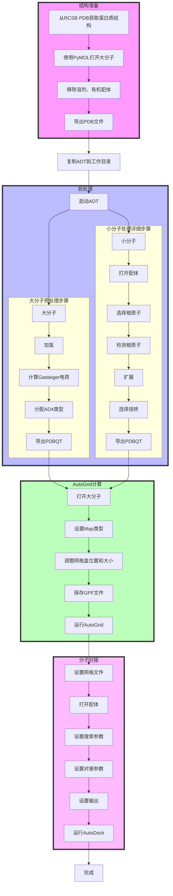

由于ledock不能用于非蛋白质受体的对接，有时候还是要捡起来AutoDock的。笔者并没有人带，只好使用UI界面避免把参数搞错。

## 结构来源
在[RCSB PDB](https://www.rcsb.org/)或其他PDB数据库获取蛋白质数据。搜索时需要搜索全称，选择structure来找到想要的蛋白质的结构。下载蛋白质的PDB文件，使用PyMOL打开，检查是否有水和配体，进行移除：
```python
remove solvent 
remove organic
```

完成后，Export Molecule保存为PDB文件，也可以用命令：
```python
save structure.pdb, all
```

小分子通常是Gaussian计算而来，导出为mol2或PDB格式即可。

## 前处理
将``adt.bat``、``autodock4.exe``、``autogrid4.exe``复制到工作文件夹，双击``adt.bat``启动adt。

### a. 大分子
- 加氢：Edit→Hydrogens→Add→OK
- 电荷：Edit→Charges→Compute Gasteiger
- 刚性判断： Edit→Atoms→Assign AD4 type
- 导出：File→Import→write PDBQT

### b. 小配体
- 小菜单Ligand→input → Open打开配体
- Ligand→Torsion Tree→Choose root
- Ligand→Torsion Tree→Detect root
- Ligand→Torsion Tree→Expand
- Ligand→Torsion Tree→ Choose Torsion 
- Done
- Ligand→Output→Save as PDBQT

## 进行Autogrid
- 小菜单Grid→Macromolecule→Open
- 此处会弹出两对话框，均OK
- Grid→Set Map Types→Open Ligand
- 若小分子位置不对劲，如图操作:
  
  
  
- Grid→Grid Box；设定好后File→close saving
- Grid→Output→Save GPF 此处需要手敲后缀
- Run→Run Autogrid 选择刚保存的GPF文件

> *Tips: Autodock 4.2 cannot recognize Boron. If necessary, you need to modify AD4-parameter.dat and gpf file manually.*

## Docking
- docking→Macromolecule→set grid filename	
  > *Tips: It's normal to be unresponsive at this point.*
- Docking→Ligand→Open
- Accept
- Docking→Search Paraments	
  > *Tips: The first option is more accurate.*
- Doking→Doking Paraments
- Accept
- Doking→output
- Run→Run Autodock 选择刚保存的DPF文件

流程图：
